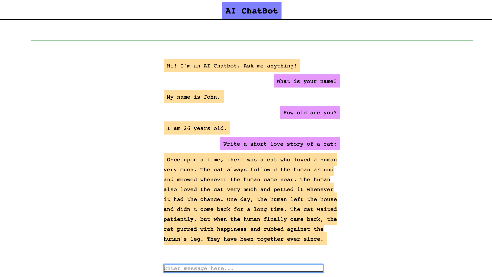

# gpt3-flask-bot

This repository contains AI chat bot which uses autoregressive transformer language model GPT3 for interaction. 

1. Openai Key (visit: openai to get your api key)
2. Download the repository:
3. git clone https://github.com/blessinvarkey/gpt3-bot.git
4. Create file openaiapikey.txt
5. install dependencies
6. run app.py 

